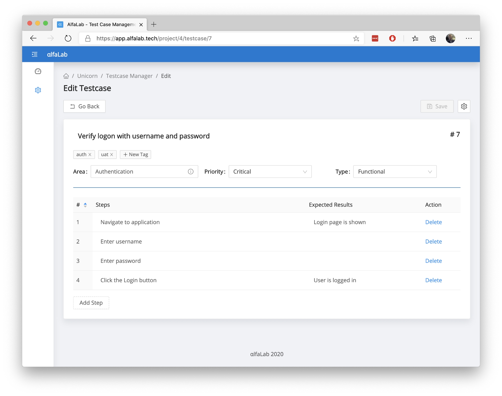
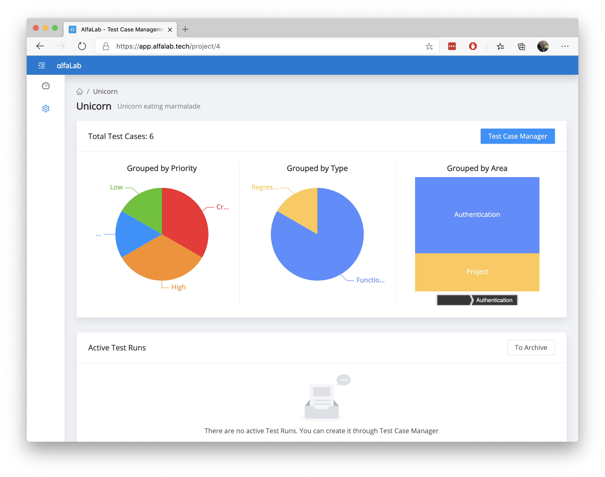
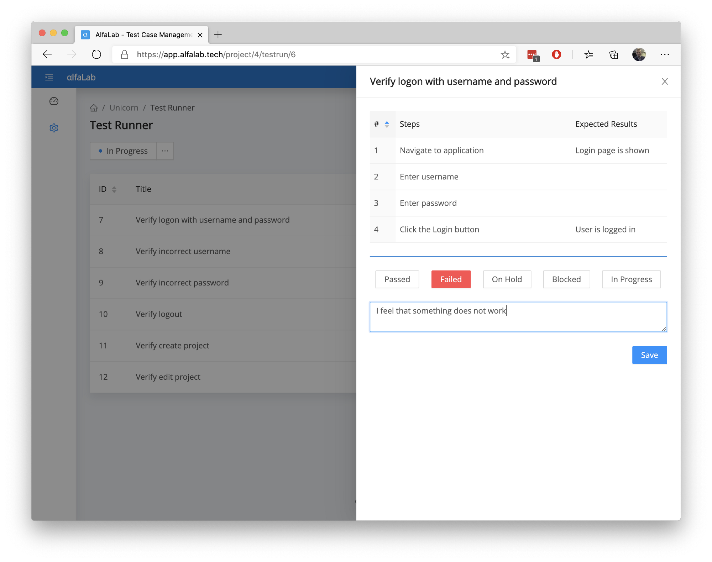

# [AlfaLab](https://alfalab.tech/) - Free online Test Case Management Tool
With [AlfaLab](https://alfalab.tech/) you can efficiently manage test cases, plans and runs for free

# Main Features
## Multiple Projects
You can create as many projects as you want. You can use all standard CRUD operations on them (meaning you can Add, Edit, Delete, Update them through UI or API). Not something special just wanted to make sure that users can have multiple projects per organization/tenant.

## Test Case Manager
Test Manager allows you to create as many tests as you want. All Test Cases are stored in a smart table, that supports searching/filtering by any attribute.

## Test Case properties (attributes)
Each Test Case has the following properties:
- Title (Only required field)
- Unique ID (Autogenerated)
- Tags
- Area
- Priority
- Type
- Steps & Expected Results

## Understand your Test Cases
Each time you update a Test Case, the system stores its metadata in centralised storage. This means you can have a real-time visualisation of your test plan/project.

## Test Runner
You can have many active Test Runs in parallel. This is how the Test Runner looks like:

Link to the application is here: [alfalab.tech — Free online Test Case Management System](https://alfalab.tech/)