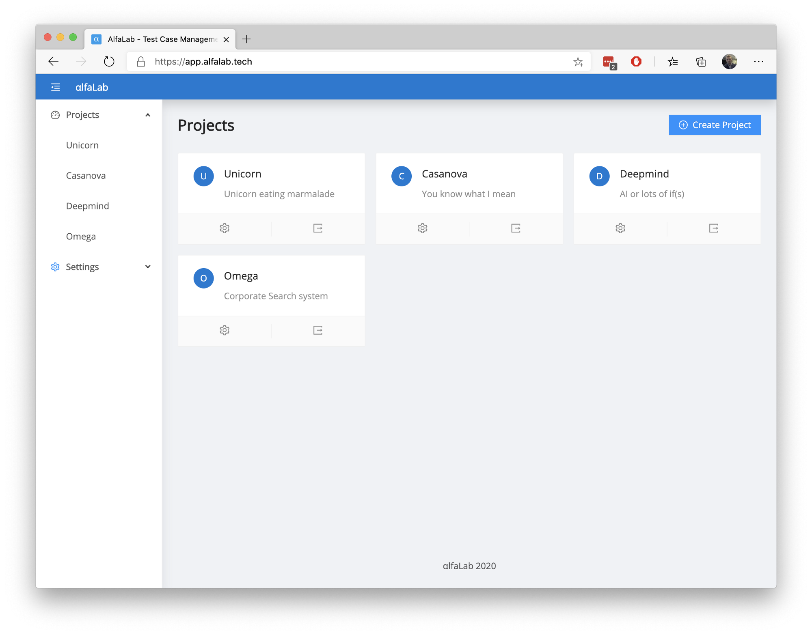
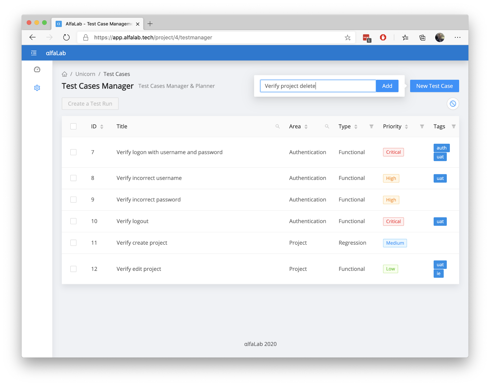

# [AlfaLab](https://alfalab.tech/) - Free online Test Case Management Tool
With [AlfaLab](https://alfalab.tech/) you can efficiently manage test cases, plans and runs for free

# Main Features
## Multiple Projects
You can create as many projects as you want. You can use all standard CRUD operations on them (meaning you can Add, Edit, Delete, Update them through UI or API). Not something special just wanted to make sure that users can have multiple projects per organization/tenant.

## Test Case Manager
Test Manager allows you to create as many tests as you want. All Test Cases are stored in a smart table, that supports searching/filtering by any attribute.
